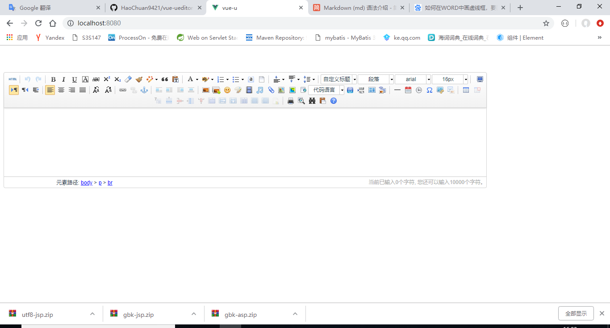

# UEditor集成vue

1、在vue集成UEditor时，我们要先看一下自己使用vue的版本，**如果版本不一致那么配置也不一样**，在这里只**演示vue-cli.3.0版本**的 
    
2、首先要创建一个vue项目：vue create vue-u   
   
3、然后我们要去下载[UEditor](https://github.com/HaoChuan9421/vue-ueditor-wrap/tree/master/assets/downloads)，**切记尽量下载百度的UEditor，BUG太多还要自己去解决**

4、在vue-u项目中install，UEditor
	
		$ npm i vue-ueditor-wrap

5、在第三步中我们下载了，utf8-jsp后我们进行一个解压，然后将utf-jsp改一下名字改为UEditor，要把UEDitor复制到**public**目录下，不需要修改任何东西

6、引用UEditor到vue中，在**App.vue**文件中写

		<template>
			

				<VueUeditorWrap :config="myConfig"></VueUeditorWrap>
				

					<button type="primary" ></button>
				

			

		</template>
		
		
		
		
	
		
7、这样配置就好了，现在启动就能看到效果了  

8、如果大家配置没有成功的话，可以去看一下[HaoChuan9421](https://github.com/HaoChuan9421/vue-ueditor-wrap)作者写的